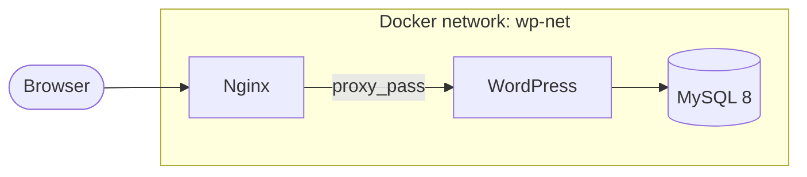

# wp-nginx-compose

A small **Docker Compose** stack that runs **WordPress** with **MySQL 8** and an **Nginx** reverse proxy. WordPress is not exposed directly; Nginx terminates HTTP/HTTPS and forwards traffic to the WordPress container on the internal network.

Built as a portfolio example of multi-container orchestration, health checks, named volumes, and reverse-proxy configuration.

## Architecture



| Service    | Image              | Role                                      |
|-----------|--------------------|-------------------------------------------|
| `db`      | `mysql:8.0`        | Database with persistent volume           |
| `wordpress` | `wordpress:latest` | PHP app (internal port 80 only)         |
| `nginx`   | `nginx:1.31.0`     | Reverse proxy, SSL, public ports 80/443   |

## Prerequisites

- [Docker](https://docs.docker.com/get-docker/) and [Docker Compose](https://docs.docker.com/compose/install/) v2+
- A hostname that matches `server_name` in `nginx/conf.d/wordpress.conf` (default: `wp.Alireza.ir`), or edit that file for your domain

## Quick start

1. **Clone the repository**

   ```bash
   git clone https://github.com/<your-username>/wp-nginx-compose.git
   cd wp-nginx-compose
   ```

2. **Configure environment variables**

   ```bash
   cp .env.example .env
   # Edit .env and set strong passwords
   ```

3. **TLS certificates** (for local HTTPS)

   Place your certificate and key in `nginx/certs/`:

   - `cert.pem`
   - `key.pem`

   For local development you can generate a self-signed pair:

   ```bash
   openssl req -x509 -nodes -days 365 -newkey rsa:2048 \
     -keyout nginx/certs/key.pem \
     -out nginx/certs/cert.pem \
     -subj "/CN=wp.Alireza.ir"
   ```

4. **Map the hostname** (if using the default `server_name`)

   Add to `/etc/hosts` (or your OS equivalent):

   ```text
   127.0.0.1  wp.Alireza.ir
   ```

5. **Start the stack**

   ```bash
   docker compose up -d
   ```

6. **Open WordPress**

   - HTTPS: `https://wp.Alireza.ir` (accept the self-signed warning in the browser if applicable)
   - HTTP on port 80 redirects to HTTPS

   Complete the WordPress installation wizard on first visit.

## Configuration

### Environment (`.env`)

| Variable | Used by | Description |
|----------|---------|-------------|
| `MYSQL_*` | `db` | Root password, database name, app user |
| `WORDPRESS_DB_*` | `wordpress` | Must match the MySQL app user and database |

`.env` is gitignored; never commit real credentials.

### Nginx

- Config: `nginx/conf.d/wordpress.conf`
- Proxies to `http://wordpress:80` on the `wp-net` network
- Sets `X-Forwarded-*` headers for WordPress behind a proxy
- HTTP → HTTPS redirect on port 80

Update `server_name` and certificate paths if you use a different domain.

### Volumes

| Volume       | Mount point              | Purpose        |
|-------------|--------------------------|----------------|
| `vol-wp-db` | `/var/lib/mysql`         | Database data  |
| `vol-wp-wp` | `/var/www/html`          | WordPress files |

## Useful commands

```bash
# View logs
docker compose logs -f

# Stop and remove containers (volumes kept)
docker compose down

# Stop and remove containers and named volumes
docker compose down -v

# Check service health
docker compose ps
```

## What this demonstrates

- **Service dependency**: WordPress waits until MySQL passes a `mysqladmin ping` health check
- **Internal networking**: WordPress is `exposed` only; Nginx is the single public entrypoint
- **Reverse proxy**: Nginx SSL termination and forwarding headers
- **Persistence**: Named volumes for DB and WordPress content
- **12-factor style config**: Secrets and DB settings via `.env`

## Production notes

This repo is oriented toward learning and local/demo use. For production you would typically:

- Use real TLS certificates (e.g. Let's Encrypt) instead of self-signed files
- Pin image digests or minor versions instead of `latest`
- Add resource limits, backups, and secrets management
- Harden MySQL and restrict exposed ports/firewall rules
- Enable `depends_on` for Nginx → WordPress if you want stricter startup ordering

## License

MIT (or adjust to your preference.)

## Author

[Your Name](https://github.com/<your-username>) — portfolio / DevOps learning project.
